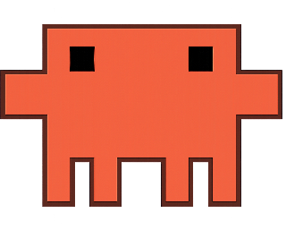
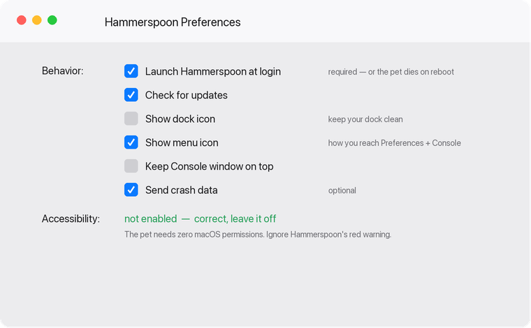

<div align="center">



# claudeaiagentreminderguy

**A little guy who sits on your screen and tells you when a Claude Code session finishes.**

Run 10+ Claude Code sessions at once? You lose track of which one is done.
This puts a draggable pixel Claude on your desktop who pops a speech bubble the
moment any session stops — named, so you know exactly which terminal to go back to.

</div>

---

## What it does

```
   ┌────────────────────────────────┐
   │  axiom-nextjs-platform-rebuild │   ▄▄▄▄▄▄▄▄▄
   │  session is done — go look     │   █ ▄   ▄ █
   │  at it.                        │   █       █
   └────────────────────────────────┘   █ █ █ █ █
```

- **Names every session correctly.** Uses your `/rename` title. Didn't rename it?
  It uses the title Claude auto-generated, then falls back to the project folder,
  and can quote the last thing you asked so you still know what it was.
- **One card per session — they stack, never merge.** Four finish at once and you
  get four cards riding up the screen, each with its full untruncated text.
- **Click a card** → the exact Terminal tab that ran that session comes forward.
- **Drag him anywhere.** Position is remembered across reboots.
- **Drawn menu, not Apple chrome.** Click the sprite for a terminal-styled menu in
  the same orange-on-black as Claude Code.
- **Night and day themes.** Black/orange or white/orange, toggled from the menu,
  remembered across restarts.
- **Menu bar icon** to hide, mute, or quit. `⌃⌥⌘P` toggles him too.
- **Zero macOS permissions.** No Accessibility, no Screen Recording, no network.

Three events fire him:

| Event | Bubble |
|---|---|
| Claude finished a turn | *"NAME session is done — go look at it."* |
| Claude is waiting on you | *"NAME is waiting on you."* |
| Session closed | *"NAME session closed."* |

---

## Install

```bash
git clone https://github.com/mattypark/claudeaiagentreminderguy.git
cd claudeaiagentreminderguy
./install.sh
```

That installs Hammerspoon if missing, copies the pet and the hook, and wires
`~/.claude/settings.json` **without touching hooks you already have** (it backs
the file up first). Sessions already running pick the hook up automatically —
no restart needed.

**Then set Hammerspoon's preferences once** — in particular **Launch Hammerspoon
at login**, or the pet won't survive a reboot. See
[Hammerspoon Preferences](#hammerspoon-preferences--set-these-once) below.

To reskin him, drop any PNG at `~/.hammerspoon/claudepet/assets/pet.png` and pick
**Reload pet** from the menu bar.

---

## Manual — running him day to day

### Where the controls are

| I want to… | Do this |
|---|---|
| Move him | Click and hold, drag. He stays where you drop him, forever. |
| Open the menu | **Click the sprite** (drawn menu), or click the **pet icon in the menu bar**, top right. |
| Hide him | `⌃⌥⌘P`, or menu → **Hide pet** |
| **Get him back** | `⌃⌥⌘P` again, or menu bar icon → **Show pet** |
| Silence alerts but keep him | menu → **Mute alerts** |
| Switch black↔white | menu → **Day mode** / **Night mode** |
| Close him completely | menu → **Quit pet** |
| **Reopen after quitting** | `open -a Hammerspoon` — or Spotlight (`⌘Space`) → "Hammerspoon" |

### Hidden vs quit — the difference

- **Hidden** — the sprite is invisible but everything still runs. Alerts still play
  a sound; you just don't see cards. Come back with `⌃⌥⌘P` or the menu bar icon.
- **Quit** — Hammerspoon is closed, so nothing is watching. No sounds, no cards.
  Your sessions keep writing to the inbox file harmlessly; he catches up on live
  events (not the backlog) when you reopen him.

The **menu bar icon is your safety net** — it's there whenever Hammerspoon is
running, even when the sprite is hidden or dragged off somewhere odd.

### Hammerspoon Preferences — set these once

Hammerspoon menu bar icon (the hammer 🔨) → **Preferences**. Match this:



| Setting | Set to | Why |
|---|---|---|
| **Launch Hammerspoon at login** | **ON** | Without it the pet is gone after every reboot and you have to reopen him by hand. **This is the one that matters.** |
| Check for updates | ON | Hammerspoon updating itself. Leave *"automatically download and install"* unchecked so you approve installs. |
| Show dock icon | OFF | He lives in the menu bar, not the dock. |
| Show menu icon | ON | The hammer icon is how you reach Preferences and the Console when something misbehaves. |
| Keep Console window on top | OFF | Only useful while debugging. |
| Send crash data | your call | No effect on the pet. |

#### About that red Accessibility warning

Hammerspoon shows **"WARNING! Accessibility is not enabled!"** with a red dot.
**Leave it off — this project does not need it.**

That warning is generic to Hammerspoon, not to this pet. The usual reason a
Hammerspoon script needs Accessibility is `hs.eventtap`, which fails outright
without it (`Unable to create eventtap`). Dragging here is done by polling
`hs.mouse.absolutePosition()` and `hs.eventtap.checkMouseButtons()` on a timer —
neither requires permission. The global hotkey uses Carbon hotkey registration,
which doesn't either.

So: drag, `⌃⌥⌘P`, menus, bubbles, sounds and terminal focus all work with the
warning showing. Fewer permissions handed out, same behavior.

### Lost him off-screen?

```bash
osascript -e 'tell application "Hammerspoon" to execute lua code "hs.settings.clear(\"claudepet.state\"); hs.reload()"'
```

He returns to the right edge of the main screen.

### Make him yours

- **Different sprite** — replace `~/.hammerspoon/claudepet/assets/pet.png`, then
  menu → **Reload pet**. Transparent PNG, roughly 300px wide.
- **Different colors, sizes, timings** — everything lives in
  `~/.hammerspoon/claudepet/theme.lua`: both palettes, bubble width, how long
  cards stay up (`bubbleHold`), fonts.
- **Different sounds** — the `COPY` table at the top of `claudepet/init.lua`.
  Any name from `hs.sound.systemSounds()` works.
- **Different hotkey** — `HOTKEY` in `claudepet/init.lua`.

---

## Build it yourself with one prompt

Don't want to clone? Paste this into Claude Code and it builds the whole thing
from scratch, on any Mac:

<details open>
<summary><b>📋 The prompt</b></summary>

````text
Build me a macOS desktop pet that tells me when my Claude Code sessions finish.

I run 10-15 Claude Code sessions at once across Terminal tabs and I lose track of
which one is done. I want a little sprite living on my screen that speaks up.

Use Hammerspoon (brew install --cask hammerspoon) — no Xcode, no app bundle.

ARCHITECTURE
A Claude Code hook writes one JSON line per event to ~/.claude/pet/inbox.jsonl.
Hammerspoon tails that file with hs.pathwatcher (plus a 3s poll as a safety net)
and pops a speech bubble next to the sprite. Use a dedicated ~/.claude/pet/
directory so the watcher isn't woken by every other write under ~/.claude.

THE HOOK  (~/.claude/hooks/claude-pet.sh)
Reads the hook payload on stdin and appends:
  {"ts","kind","session","session_id","named","hint","cwd","tty"}
Resolve the session's display name in this priority order:
  1. ~/.claude/sessions/<pid>.json — find the record whose "sessionId" matches
     the payload's session_id, and use its "name". That file is where /rename
     persists, AND where Claude's own auto-generated title lands.
     If "nameSource" == "derived" the name is a placeholder (like "matthewpark-59")
     — treat that as unnamed.
  2. The transcript at payload["transcript_path"] contains "ai-title" and
     "last-prompt" records. Read the tail (last ~200KB, scan backwards) and use
     aiTitle as the name, lastPrompt as a hint line for the bubble.
  3. basename of cwd.
Get the Terminal tty from the session record's "pid" via `ps -p PID -o tty=` —
store it so clicking the bubble can focus that tab.

Three gotchas that will bite you:
  - Buffer stdin into a bash variable BEFORE the python heredoc; a heredoc takes
    over fd 0 and the payload vanishes.
  - `ps -p $$ -o tty=` inside a hook returns "??" — the hook has no controlling
    tty. Use the Claude process pid from the session record instead.
  - Swallow every error and always `exit 0`. This runs on every turn; it must
    never block or fail one.

THE PET  (~/.hammerspoon/claudepet/)
Split into modules: init.lua (wiring), pet.lua (sprite), bubble.lua, terminal.lua
(AppleScript tab focus), theme.lua (design tokens), state.lua (hs.settings).

  - hs.canvas at windowLevels.floating, behavior canJoinAllSpaces|stationary,
    clickActivating(false). Gentle sine bob on a timer.
  - DRAG: click-and-hold to move. Do NOT use hs.eventtap — it fails outright
    without Accessibility permission ("Unable to create eventtap"). Instead, on
    mouseDown start a 60fps hs.timer that reads hs.mouse.absolutePosition() and
    hs.eventtap.checkMouseButtons(); end the drag when the button releases.
    Neither call needs permissions. Movement under ~4px = a click, not a drag.
  - Persist x/y/hidden/muted in hs.settings so he returns to the same spot.
  - Bubble: rounded dark card, session name in the sprite's accent color, body
    below. Sits on whichever side of the pet has room. Auto-fades after 10s.
    Clicking it focuses the Terminal tab via AppleScript matching on tty.
  - Batch events within ~1.5s into one bubble: "3 sessions done" plus the names.
  - Dedupe repeat alerts for the same session within 5s.
  - On inbox truncation resume at the new file size — never re-read from 0, or
    you get a burst of alerts for stale sessions.
  - hs.menubar item with the sprite as its icon: show/hide, mute, recent sessions
    (click one to focus its terminal), test bubble, reload, quit. Same menu pops
    at the cursor when the sprite itself is clicked. Bind ⌃⌥⌘P to toggle.
  - When hidden, alerts play sound only — no visuals.
  - Don't put an hs.alert on config load; it fires on every reload and is noise.

WIRING  (~/.claude/settings.json)
Back the file up first, then APPEND without disturbing existing hooks:
  Stop                        → claude-pet.sh done
  SessionEnd (matcher "*")    → claude-pet.sh end
  Notification ("idle_prompt")→ claude-pet.sh idle

SPRITE
I'll drop a PNG at ~/.hammerspoon/claudepet/assets/pet.png. If it has a solid
background, flood-fill from the edges to transparent (PIL), crop to the bbox, and
downscale to ~320px — a floating opaque rectangle looks broken on the desktop.

Verify it end to end: fire a synthetic inbox line, confirm a real session's name
resolves from the sessions directory, confirm multi-session collapse, confirm
hide/show survives a reload, and confirm my pre-existing hooks still run.
````

</details>

---

## How it works

```
Claude Code session ends
        │
        ▼
  Stop / SessionEnd / Notification hook
        │
        ▼
  ~/.claude/hooks/claude-pet.sh
        │   • matches session_id → ~/.claude/sessions/<pid>.json  (the /rename name)
        │   • falls back to transcript ai-title / last-prompt
        │   • resolves Terminal tty from the session pid
        ▼
  ~/.claude/pet/inbox.jsonl        ← one JSON line per event
        │
        ▼  hs.pathwatcher + 3s poll
  ~/.hammerspoon/claudepet/
        │
        ▼
  🗨  speech bubble beside the sprite
```

**Why a file instead of a socket or the `hs` CLI:** no `hs.ipc.cliInstall()`, no
port, no daemon. It survives Hammerspoon restarts and a hook that fires while
Hammerspoon is closed simply lands in the file harmlessly.

### Where session names actually come from

The interesting discovery behind this project. Claude Code keeps a live record
per session at `~/.claude/sessions/<pid>.json`:

```json
{
  "pid": 30808,
  "sessionId": "49b91b19-d4ce-4251-8d3f-1a19d4e86909",
  "cwd": "/Users/matthewpark",
  "name": "desktop-pet-session-notifier",
  "nameSource": "derived",
  "status": "busy"
}
```

`/rename` writes `name`. Claude's own auto-titling also writes `name`. So even
sessions you never renamed get a meaningful label — and `pid` gives you the
Terminal tty for free.

---

## Layout

```
hammerspoon/
  init.lua                  # requires the pet, enables the AppleScript bridge
  claudepet/
    init.lua                # wiring: inbox tail, dedupe, batching, menus, hotkey
    pet.lua                 # sprite canvas, bob, permission-free drag
    bubble.lua              # speech bubble canvas
    terminal.lua            # AppleScript tab focus by tty
    theme.lua               # colors, sizes, timings
    state.lua               # hs.settings persistence
    assets/pet.png          # swap this to reskin
hooks/
  claude-pet.sh             # the Claude Code hook bridge
install.sh
```

---

## Troubleshooting

**Nothing happens when a session ends**

```bash
tail -f ~/.claude/pet/inbox.jsonl     # is the hook writing?
```

Empty → the hook isn't wired. Check `~/.claude/settings.json` for `claude-pet.sh`.
Writing but no bubble → Hammerspoon isn't running, or the pet is hidden.

**Inspect the pet's live state**

```bash
osascript -e 'tell application "Hammerspoon" to execute lua code "return hs.inspect(claudepet.debug())"'
```

**Fire a test bubble**

```bash
osascript -e 'tell application "Hammerspoon" to execute lua code "claudepet.test(\"my-session\")"'
```

**Lost him off-screen**

```bash
osascript -e 'tell application "Hammerspoon" to execute lua code "hs.settings.clear(\"claudepet.state\"); hs.reload()"'
```

**Errors** — Hammerspoon menu → Console.

---

## Requirements

macOS · Hammerspoon · Claude Code · Terminal.app for click-to-focus
(everything else works in any terminal)

## License

MIT
